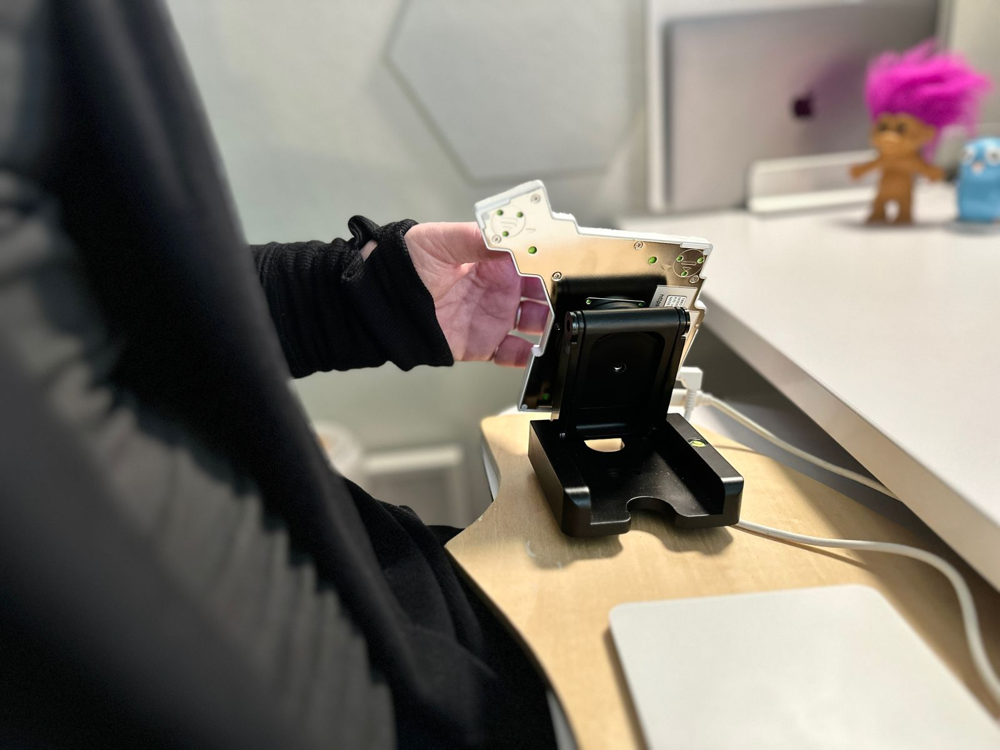
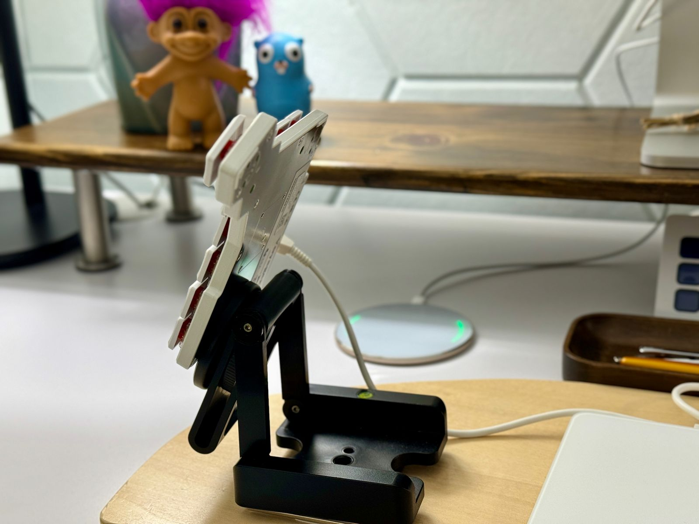
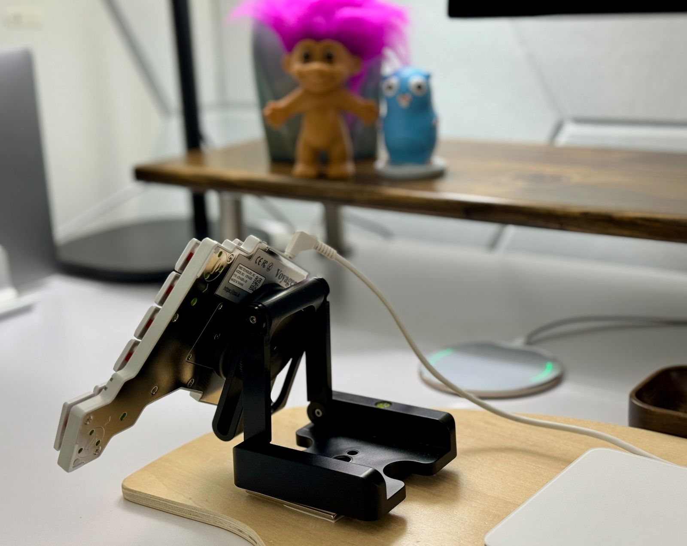

## Who are you, and what do you do? What do you like to do outside of work? (Please feel free to link to your blog here, or anywhere else you'd like)

Hi, I'm Laura! I'm a lifelong resident of the SF Bay Area (but am also a Canadian citizen), and my most recent job title is "Developer Advocate" but I'm currently funemployed following an acquisition-induced layoff from a company in the WebAssembly space, where I owned our docs. I consider myself a Professional Generalist and before I pivoted into the tech industry I was a math lecturer (but before I settled on math I switched majors between theater, English, Italian studies, astrophysics, fashion design, and computer science) . I'm fortunate to be able to take this time to explore all of my varied interests and see where I might like to go next when the job market recovers.

I'm neurosparkly, from the [AuDHD](https://embrace-autism.com/autistic-and-adhd-traits/) zone of the [neuroverse](https://www.lauralangdon.io/blog/the-neuroverse/). I love discovering the connections between things, and lately that's had me on a linguistics kick thanks to the [History of English podcast](https://historyofenglishpodcast.com/). I spend a lot of time configuring my tools to work and look *just right* for me, which is probably true of every person who reads a newsletter like this one. 😁 Fiber arts like knitting and crochet keep my hands busy when they're not on my keyboard.

I blog on [my website](https://lauralangdon.io) and stream on [Twitch](https://www.twitch.tv/LauraLangdon) and [YouTube](https://youtube.com/@Laura-Langdon). You can also find me on [Mastodon](https://hachyderm.io/@LauraLangdon) and [Bluesky](https://bsky.app/profile/lauralangdon.io)!

## What hardware do you use?

A 16" MacBook Pro with an M1 Max is my primary machine, and my current daily driver keyboard is a white Voyager (I also have and love her big sister—my first ergo!—the Moonlander). When I'm streaming or have a video meeting I use a [Fully desk](https://store.hermanmiller.com/brands-fully?lang=en_US), and I have a [Studio Display](https://www.apple.com/studio-display/) on a walnut monitor stand my husband made for me. My chair is a [Mirra 2](https://www.hermanmiller.com/products/seating/office-chairs/mirra-2-chairs/), and I use a [Canon EOS RP](https://www.amazon.com/gp/product/B07N9KDCGV/ref=ppx_yo_dt_b_search_asin_title?ie=UTF8&psc=1) with an [RF24-105](https://www.amazon.com/gp/product/B084BKXDLD/ref=ppx_yo_dt_b_search_asin_title?ie=UTF8&psc=1) lens and an [Elgato Cam Link](https://www.elgato.com/us/en/p/cam-link-4k) as a webcam. I have a [Wave:3](https://www.elgato.com/us/en/p/wave-3-black) microphone on a [low-profile mic arm](https://www.elgato.com/us/en/p/wave-mic-arm-lp), and a [Key Light Air](https://www.elgato.com/us/en/p/key-light-air) with 3D-printed barn doors. I use a [Stream Deck](https://www.elgato.com/us/en/p/stream-deck-mk2-black) to control my lighting.

![alt="White standing desk with white and grey office chair in front of it, green dresser to the left, and walnut nightstand to the right. On the desk is a monitor on a long dark wood stand along with a turquoise lamp and a leafy plant. Also on the desk are two laptops stood vertically, a few cute figurines, wooden trays for office items, and a gold headphone stand holding white headphones. The desk has a keyboard tray with a split keyboard on it, steeply tented, and a trackpad between the keyboard halves.'](desk-setup.jpeg)

You can see below how the angle of the base of the Voyager relative to the lap desk supporting it is nearly 90 degrees, and that combined the angle of the left edge of the Voyager relative to the lap desk lets my wrist stay completely neutral. My forearm is supported by the arm of my chair, and my hand just floats alongside the keyboard.

When I work from bed I put my laptop on a [bed desk](https://www.amazon.com/gp/product/B08T5ZKWCP/ref=ppx_yo_dt_b_search_asin_title?ie=UTF8&psc=1) and my keyboard on a lap desk that can sit in front of me when I'm sitting cross-legged, or on my lap when I'm reclining.

I have a second Studio Display I sometimes use when not at my desk, with an [Ergotron monitor stand](https://www.amazon.com/gp/product/B00HQA1BRS/ref=ppx_yo_dt_b_search_asin_title?ie=UTF8&psc=1) that has a wide base and very low center of gravity so it's stable on the bed desk or on my [lift-top coffee table](https://havenly.com/products/details/Denson-Melamine-Veneer-Wood-Hidden-Storage-Lift-Top-Coffee-Table-Wayfair-71137005).

But usually when I'm not at my desk I'm looking at three AR monitors on my [XREAL Air glasses](https://www.xreal.com/air), which I was introduced to by a [previous interview](https://people.zsa.io/andrew-thompson/) in this newsletter!

## And what software?

I'm gradually transitioning from VS Code to [NeoVim](https://nvchad.com/) for writing code and docs, and a few months ago I switched from [iTerm2](https://iterm2.com/) to [Warp](https://warp.dev) for my terminal. [GitKracken](https://www.gitkraken.com/) helps me when Git gets convoluted, and [Raycast](https://www.raycast.com/) and an array of apps I have through [SetApp](https://setapp.com/) optimize my macOS workflow.

I adore the [Arc browser](https://arc.net/), and I use [Obsidian](https://obsidian.md/) for personal knowledge management (Markdown and Vim bindings for all the things!). I use [Anki](https://obsidian.md/) cards to learn new things, [1Password](https://1password.com/ )for passwords and passkeys, [Vimcal](https://www.vimcal.com/) for calendar and scheduling, and [Shortwave](https://www.shortwave.com/) for email (RIP Google Inbox 😭). For streaming I use [ReStream](https://restream.io/login?continue=https://app.restream.io/home), and for videos I've just started using [Screen Studio](https://www.screen.studio/).

## What’s your keyboard setup like? Do you use a custom layout or custom keycaps? (If you include a link to your layout in the configurator, we can embed it right into the interview for people to check out)

My keyboard usually lives on a lightweight [lap desk](https://www.amazon.com/gp/product/B019J91KIS?th=1) that I've trimmed down, and I have [Velcro dots](https://www.amazon.com/gp/product/B00GUZK4I2/ref=ppx_yo_dt_b_search_asin_title?ie=UTF8&psc=1) on the underside of the lap desk and on the keyboard tray of my desk so I can plop the lap desk down on the keyboard tray and it'll stay put. I've also used the Velcro dots to attach a [Magic Trackpad](https://www.apple.com/shop/product/MK2D3AM/A/magic-trackpad-white-multi-touch-surface) between the two halves of the keyboard.

After trying several different tenting solutions I've landed on using [Z-shaped camera mounts](https://www.amazon.com/gp/product/B07MHJ2TL6/ref=ppx_yo_dt_b_search_asin_title?ie=UTF8&psc=1), which I've attached to the lap desk with [bar magnets](https://www.amazon.com/gp/product/B08L3FVFFZ/ref=ppx_yo_dt_b_search_asin_title?ie=UTF8&psc=1). On each camera mount I've attached a [MagSafe tripod mount](https://www.amazon.com/gp/product/B0BPLW4ZTZ/ref=ppx_yo_dt_b_search_asin_title?ie=UTF8&psc=1), which is a perfect match for the Voyager's magnetic base! For the Moonlander I use [MagSafe stickers](https://www.amazon.com/Adhesive-Wireless-Converter-Accessories-Rectangle/dp/B09WRS2TGJ/ref=sr_1_3?crid=164D4ULV0DJ00&keywords=magsafe+stickers&qid=1698283791&sprefix=round+keycaps%2Caps%2C169&sr=8-3) on its base for a similar effect (not quite as good, though, since the magnetic surface is limited to the size of the sticker).

The magnetic attraction between the base of the Voyager and the tripod mount is *strong*. I can position the Voyager high up on the mount when I need extra height for a particular position:

 I can achieve any degree of rotation:

When I move into a new position, I let my hand achieve a natural position and then adjust one or more of the above until the keyboard is aligned perfectly to my hand and fingers, not the other way around.

I also frequently work from an [armchair](https://www.amazon.com/gp/product/B0B1HNR329/ref=ppx_yo_dt_b_search_asin_title?ie=UTF8&psc=1) that has a cover with a zipper underneath, so I used fabric tape to put magnets under the cover, inside the arms to attach my Voyager directly to the arms of the chair.

It worked and it was very cool! But because the keyboard halves need to be connected, the cable acted as a sort of gate each time I stood up, and it turned out that the lap desk and Z mounts, though not quite as cool, provided the best solution yet again.

I have small hands, so my layouts ([Voyager](https://configure.zsa.io/voyager/layouts/VjK4J/latest/0) and [Moonlander](https://configure.zsa.io/moonlander/layouts/j99vd/latest/0)) keep my fingers almost exclusively on the three main rows (home row and the rows above and below home), so I don't need to stretch my fingers. The [pink raised dot stickers](https://www.amazon.com/gp/product/B087CSZYH2/ref=ppx_yo_dt_b_search_asin_title?ie=UTF8&psc=1) I added to the top row and home keys are to help me know which row I'm touching (apparently this is called "indexing"!).

My Voyager came with Kaihl Choc Reds, which are fine so far. I've added O-rings to the switches, and sometime soon I'l see how many of the [acoustic mods](https://www.reddit.com/r/ergodox/comments/vwo6z6/ergodox_acoustics_and_how_i_did_improve_them/ifvlzkw/?utm_source=share&utm_medium=web3x&utm_name=web3xcss&utm_term=1&utm_content=share_button) I made to my Moonlander can be duplicated in the more compact Voyager case. Someday I'll [tape and lube](https://www.youtube.com/watch?v=3YBNRXRXG0w&t=285s&pp=ygUPY2hvYyBzd2l0Y2ggbW9k) the switches. No one seems to make cute keycaps for Choc switches. 🤔

For the Moonlander I tried a few different tactile and linear switches and weights, and settled on 63.5g [Healios linear switches](https://zealpc.net/collections/switches/products/healio?variant=13159117717567) from Zeal, which I lubed and filmed. The Moonlander has *lots* of outfits (keycap sets), and some of my favorites are [MechSupply's Vilebloom](http://www.mechsupply.co.uk/product/dsa-vilebloom), [Mintlodica's Witch Girl](https://mintlodica.com/products/dsa-witch-girl-keycaps), and [Epomaker's Honey-Milk](https://www.amazon.com/EPOMAKER-Honey-Milk-Sublimation-Mechanical-Compatible/dp/B09D3KRTJX).

## What would be your dream setup?

Iterating is fun for me, so I doubt I could have an "end-game" setup. But right now I'm playing with ideas to eliminate the keyboard tray on my desk to optimize the surprisingly complex spatial relationships between my camera, monitor, desk, chair, and background. I'm also *dying* to try the [Vision Pro](https://www.apple.com/apple-vision-pro/)! Having a dedicated office would be lovely.
